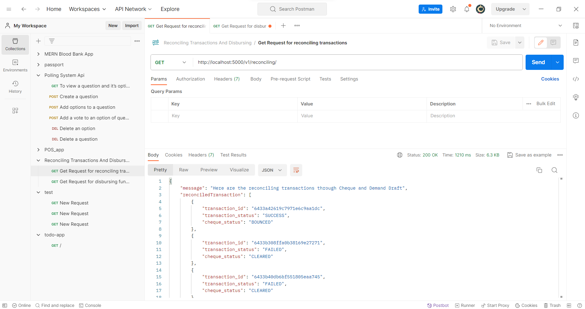
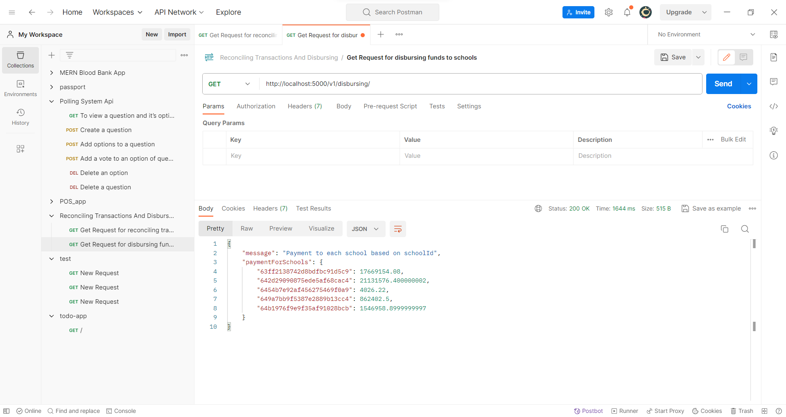

# Edviron Task 3
API's for reconciling transactions and disbursing funds to schools.
- Base url - http://localhost:5000

## API Reference
This backend system provides following endpoints

### Get Request for reconciling transactions
* GET /reconciling transactions
### Get Request for disbursing funds to schools
* GET /disbursing funds to schools


## Installation

Use the package manager npm or yarn to install.

```bash
npm install
```
Above command will install everything through package.json


Start the application using the following command:
```
$ node index.js
```

Open the application in your web browser by visiting the following URL:
```
$ http://localhost:5000
```
## Screem Shot




